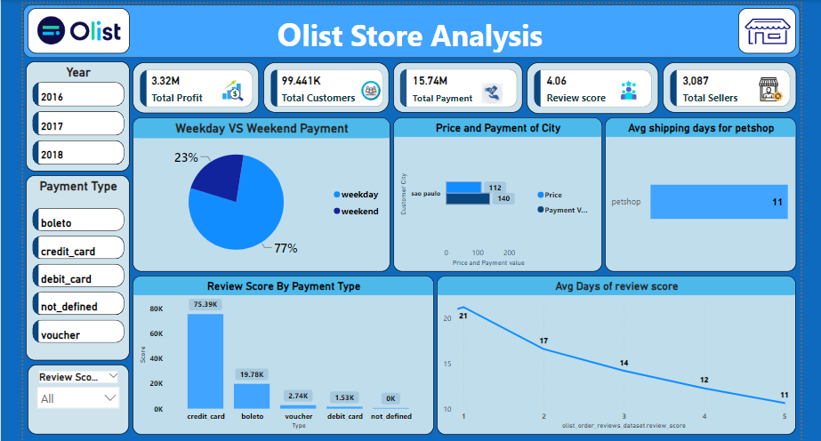

# Ecommerce--Olist-Store-Analysis
## About This Project

The Olist Store Analysis Project focuses on uncovering valuable insights from an e-commerce dataset, using tools like Power BI, SQL, and Excel for analysis and visualization. The project examines various aspects of customer behavior, payment patterns, and delivery efficiency, helping to identify trends and improve decision-making. By analyzing this data, the goal is to enhance business operations and customer satisfaction for the Olist platform.

## Problem Statement
The goal of this project is to help the Olist E-commerce platform analyze key customer and order-related metrics to improve operational efficiency, customer satisfaction, and profitability.

## Datasets 
The dataset used for this project is the Olist Store dataset, which includes the following data files:
**Orders**: Details of customer orders, including timestamps, order status, and delivery dates.
Payments: Payment information, including payment type, installment options, and payment values.
Reviews: Customer reviews containing ratings, comments, and timestamps for feedback.
Order Items: Product details associated with each order, including product IDs, seller information, prices, and freight values.
Products: Information about products, including product categories and descriptions.
Customers: Customer details such as unique IDs, locations, and demographic information.
Sellers: Data related to sellers, including IDs and location details.
Geolocation: Geographical data for mapping customer and seller locations.

## Datasets
The dataset used for this project is the Olist Store dataset, which includes the following data files:
- **Orders**: Details of customer orders including timestamps and status.
- **Payments**: Payment information including payment type and value.
- **Reviews**: Customer reviews, ratings, and comments.
- **Order Items**: Product details and freight values.

 
## Tools and Technologies
- **Power BI**: For building interactive visualizations and dashboards.
- **SQL**: For data querying, joining datasets, and analysis.
- **Excel**: For cleaning data and pivot table analysis.

  ## Steps Followed
1. **Data Cleaning**: Removed duplicates, handled missing values, and merged datasets.
2. **Data Exploration**: Analyzed patterns in payment methods, review scores, and delivery timelines.
3. **KPI Definition**: Defined key performance indicators to measure customer satisfaction and sales performance.
4. **Data Visualization**: Created visualizations in Power BI to present the findings.

## Key Analyses
1. **Weekday vs Weekend Payment Statistics**: Analyzed the payment statistics based on the day of the week.
2. **Orders with Review Score of 5 and Credit Card Payment Type**: Filtered orders with the highest review score and specific payment method.
3. **Average Delivery Time for Pet_shop Category**: Calculated the average delivery time for pet-related products.
4. **Average Price and Payment Values for São Paulo Customers**: Extracted insights on customer spending from São Paulo.
5. **Shipping Days vs Review Scores**: Analyzed the correlation between shipping time and customer satisfaction.

## Dashboard

